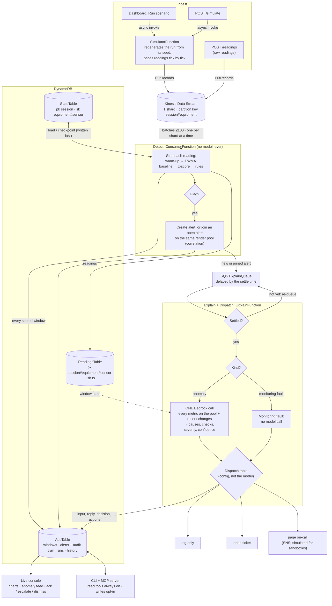
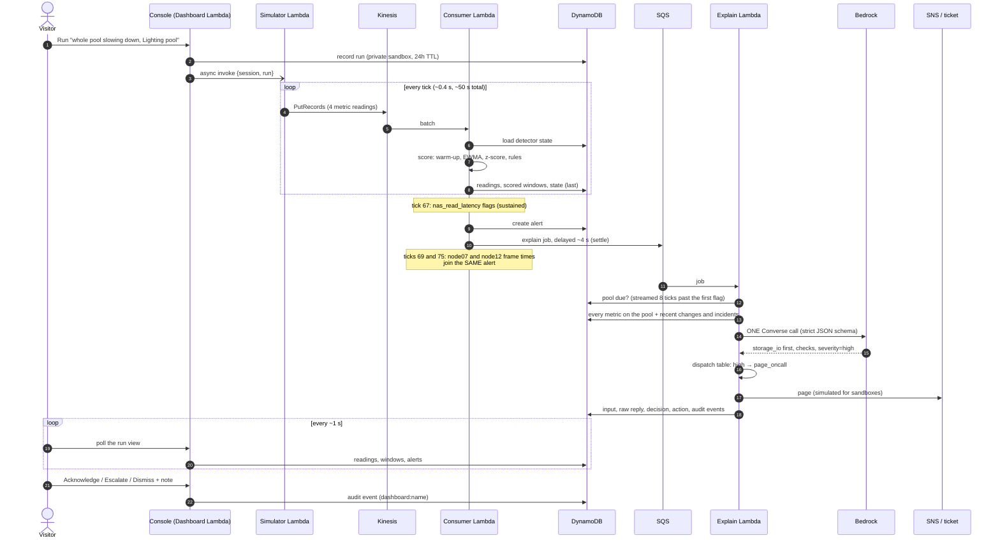

# Northfen telemetry pipeline: architecture

Northfen Studios is a fictional animation/VFX studio; this pipeline watches its render farm.
In the code, a **render pool** is an `equipment` record and each of its **metrics** is a
`sensor` (the field names predate the render-farm framing; the mechanics are identical).

**Stream → Detect → Explain → Dispatch.** This is deliberately *not* the Ingest → Classify → Route
(ICR) shape of the Rivergate and Amberlight demos. ICR classifies one discrete item with a model
and routes it. Here the input is a continuous stream, detection is plain statistics with state
carried across Lambda invocations, and the model is only called downstream of a deterministic
trigger, to explain something that has already been decided is anomalous.

> **Design rule:** AI does diagnostic synthesis over already-detected anomalies. AI never decides
> whether something is anomalous. That stays 100% deterministic statistics in Go, testable
> without touching Bedrock.

## Data flow



### One alert, end to end

The storage-slowdown scenario (`10`) from the console: three metrics on one render pool, one alert, one model call.



## Detection (deterministic, `internal/detect`)

Per series (one metric on one render pool, in one session and run):

| Stage | What happens |
|---|---|
| Warm-up | The first `warmup` (20) readings set a reference mean and sigma. Sigma is the population std, floored at the metric type's `min_sigma` so a very quiet metric can't produce huge z-scores from meaningless wiggles. Sigma is then **held** so a slow drift can't inflate its own noise estimate and hide itself. |
| Baseline | An EWMA mean (`ewma_alpha` 0.1) that only in-control readings (\|z\| < `sustained_z`) update, so an excursion can't drag its own baseline along. |
| Score | z = (value − baseline) / sigma for every reading after warm-up. |

| Rule | Fires when | Kind |
|---|---|---|
| `spike` | \|z\| ≥ `spike_z` (5.0; 6.0 for bursty failed-frame counts) on one reading | anomaly |
| `sustained` | \|z\| ≥ `sustained_z` (3.0, **inclusive**) for `sustained_count` (3) consecutive readings, same direction | anomaly |
| `drift` | \|baseline − warm-up reference\| ≥ `drift_sigma` (4) × sigma. This catches a creep too slow for any single reading to look alarming | anomaly |
| `stuck` | the last `stuck_count` (12) readings span ≤ 0.01 σ. A live metric always moves | monitoring fault |
| `dropout` | `dropout_count` (3) missing readings in a row. Missing is neither zero nor normal | monitoring fault |

An episode opens on the first rule that fires (monitoring-fault rules outrank anomaly rules, since a
frozen metric's z-score is meaningless) and closes after `clear_after` quiet readings. Every value
is in `config/northfen.yaml` with per-metric-type overrides, not hardcoded.

**Monitoring faults (frozen or silent metrics):** they open an alert of kind `sensor_fault` that
goes straight to `open_ticket` **without a model call**, because the monitoring itself is broken and there's no farm
behaviour to diagnose. Marian confirmed this choice (2026-09-23).

**Correlation:** a flag on another metric of the same render pool (same run) within `group_ticks` of an
open alert joins that alert, so there's one diagnosis and one page per incident. The explain call
waits `settle_ticks` (8) after the first flag so metrics that cross a moment later are included.
If a metric joins after the explanation, it is re-explained once (`max_explains_per_alert: 2`).
Actions only ever escalate: a re-explanation can raise log → page, but never repeats or lowers one.

## Explain (`internal/explain`)

One bounded call per alert, not a chatbot: a fixed system prompt, one user message with the JSON
input, temperature 0, no tools. The output must parse into exactly:

```json
{"likely_causes": ["mechanical_wear", "..."], "explanation": "1-2 sentences",
 "recommended_checks": ["..."], "severity": "low|medium|high", "confidence": 0.0}
```

Unknown fields are rejected (the model can't add `"action"` or `"is_anomalous"`), causes must
come from the configured category list, and confidence must be 0–1. Anything else counts as a
failure, and a failed explanation goes to a human. The input and the raw reply are stored on the
alert. An offline `mock` explainer (a labelled lookup table, not a model) implements the same
interface for local runs and tests.

## Dispatch (`internal/dispatch`)

The same principle as the ICR router: the model outputs structured judgment, and plain config
decides what happens. The rules are ordered and the first match wins:

| Rule | Action |
|---|---|
| explanation failed | page on-call (a human diagnoses it) |
| monitoring fault | open ticket |
| confidence < 0.6 (any severity) | page on-call: **uncertain explanations go to a human, not auto-dismissed** |
| severity high | page on-call |
| severity medium | open ticket |
| severity low | log only |
| *floor:* max \|z\| ≥ 8 | at least a ticket (the model can't talk a large excursion down to a log line) |

Tickets are a stub (a `TKT-…` id in the audit trail and CloudWatch). Pages publish to SNS, except
from public visitor sandboxes, where they're recorded as simulated.

## Storage: DynamoDB, not Timestream

**Timestream for LiveAnalytics was the first choice, but it has been closed to new customers
since 2025-06-20** ([AWS notice](https://docs.aws.amazon.com/timestream/latest/developerguide/AmazonTimestreamForLiveAnalytics-availability-change.html)).
Only accounts already using it can create resources, and the `demos-admin` account never has.
AWS's suggested replacement, Timestream for InfluxDB, is an always-on provisioned instance inside
a VPC. It bills around the clock for a demo that's idle most of the time, and it would put every
Lambda in a VPC. Marian chose the DynamoDB fallback (2026-09-23), the same pattern Rivergate and
Amberlight already use:

| Table | Keys | Holds |
|---|---|---|
| `ReadingsTable` | pk `series` = `<session>#<equipment_id>#<sensor_id>`, sk `ts` (fixed-width UTC) | the metric time series. The explain step's window read is one Query |
| `StateTable` | pk `session_id`, sk `series` = `<equipment_id>#<sensor_id>` | detector state (JSON), the consumer's checkpoint |
| `AppTable` | pk/sk + `gsi1` | scored windows, alerts with audit trail, runs, session counters, equipment history |

The session prefix on the time-series key is what keeps visitor sandboxes apart. Everything
carries `expires_at` (24 h TTL), and reads also hide expired records immediately, since TTL
deletes lazily. `internal/store/storetest` runs one contract suite against the in-memory, file
and DynamoDB stores (the latter against a fake), so they can't drift apart.

## Why this is safe on a stateless Lambda

- **State is externalized** per `equipment_id#sensor_id` and is small JSON. A test scores a
  stream in batches of 1, 3, 7 and 50 with a JSON round trip between every batch, and gets
  exactly the result of one continuous run.
- **One batch per shard at a time** (`ParallelizationFactor: 1`, partition key
  `session#equipment`), so a series is never scored by two invocations at once.
- **At-least-once delivery is harmless:** readings at or before a series' last tick are skipped,
  alert and window IDs are deterministic hashes, alerts are created with a conditional put, and
  the detector state is written last. A replayed or retried batch changes nothing (tested by
  redelivering every batch).
- **Concurrent writers:** the consumer (adding a correlated metric) and the explain worker
  (recording an explanation) update an alert with optimistic versioning and retry on conflict.

## Public demo sandboxing

Every sign-in to the hosted console gets a private session `v` + 16 hex. Runs, readings, windows,
alerts and counters are all keyed by it and expire after 24 h. Each sandbox gets 12 runs and 20
model calls, one run streams at a time, and the simulator's reserved concurrency is 5. Visitors
never see each other's data, and sandbox pages never reach SNS.

## Interfaces

- **CLI** (`cmd/northfen`): `simulate <scenario> [-live | -via-kinesis]`, `score` (detection only,
  no store, no AWS), `explain <window-id|alert-id>` (refuses unflagged windows), `feed`,
  `status`, `ack [-dismiss|-escalate]`, `history`, `mcp`.
- **MCP** (`internal/mcp`): read tools `feed`, `status`, `get_sensor_history`, `list_scenarios`
  are always on. Write tools `ack`, `escalate` and `simulate` (it injects data) are enabled one by
  one with `-allow-write`, advertised only when enabled, audited to stderr and to the alert's
  trail. No tool can change a threshold, un-flag a window or pick the dispatch action.
- **Webhook** (`POST /simulate`, `POST /readings`, `X-Northfen-Token`): lets callers that aren't a
  Kinesis producer start a streamed scenario or put raw readings on the stream.

## Phases (all local-first)

1. Detector, explain behind an interface (mock + Bedrock), dispatch, CLI, and fixtures with
   `demo/expected.json`. Tests cover every scenario, including the exact z = 3.0 boundary.
2. Kinesis consumer and SQS explain handlers, driven locally by stand-ins that encode records
   exactly like the producer (`northfen simulate -via-kinesis`), over the DynamoDB fake in tests.
3. Live dashboard, dispatch and the acknowledgment flow.
4. MCP server with the read/write split enforced.
5. SAM (`infra/template.yaml`): `sam validate --lint` and `sam build` pass. The deploy is run by
   Marian (see `infra/README.md`).
